# EDOM Project, Part 1, Tool 1 - MPS (Meta Programming System)

## Description of the Tool

[MPS (Meta Programming System)](https://www.jetbrains.com/mps/) is a language workbench developed by JetBrains that enables the design, implementation and integration of domain-specific languages (DSLs). Its primary objective is to simplify the development of specialized programming languages tailored to particular problem domains.

Traditional programming languages rely on textual representations of code that must be processed by parsers. These parsers analyze the syntax of a given language and transform it into internal data structures that represent the program. However, since parsers are typically designed for a single language grammar, combining multiple languages or extending existing ones can become complex and difficult to maintain.

MPS addresses this limitation through an approach known as **projectional editing**, which is closely related to the concept of **language modularization**. Instead of relying on textual code that needs to be parsed, MPS directly represents programs as structured data in the form of an **Abstract Syntax Tree (AST)**. In this representation, code is composed of interconnected nodes, each containing a set of properties and relationships that define the structure and semantics of the program.

By eliminating the need for parsing, MPS enables the seamless composition of multiple languages within the same environment. This significantly improves the flexibility of language development and facilitates the creation of DSLs that are easier to use and maintain.

Furthermore, MPS provides mechanisms for defining **concepts**, **constraints** and **generation rules**. Concepts define the fundamental building blocks of a language, constraints enforce structural and semantic correctness and generation rules specify how models created with the DSL are transformed into executable source code. Through these mechanisms, developers can precisely control both the structure of the language and the behavior of the generated artifacts.

## How to Setup and Install

The installation and setup process of [MPS (Meta Programming System)](https://www.jetbrains.com/mps/) is straightforward and follows the standard distribution model used by JetBrains development tools. The following steps describe the recommended procedure for installing and configuring the environment.

### 1. Download the Tool

The first step consists of downloading the latest stable version of MPS from the official JetBrains website. The installation package is available for the major operating systems, including Windows, macOS and Linux.

The tool can be obtained from the official download page:

- https://www.jetbrains.com/mps/

### 2. Install the Application

After downloading the installation package, the user should execute the installer and follow the instructions provided by the setup wizard. The process typically involves selecting the installation directory and confirming the default configuration options.

For Linux systems, the installation may involve extracting the provided archive and executing the application directly from the extracted directory.

### 3. Launching MPS

Once the installation process is completed, the application can be launched through the operating system’s application menu or by executing the MPS executable file located in the installation directory.

Upon startup, MPS initializes its development environment and prompts the user to either open an existing project or create a new one.

### 4. Creating a New Project

To begin using MPS, a new project must be created. This can be done by selecting the **“New Project”** option in the startup interface. The user will then be prompted to define a project name and select the desired project location (Figure 1).

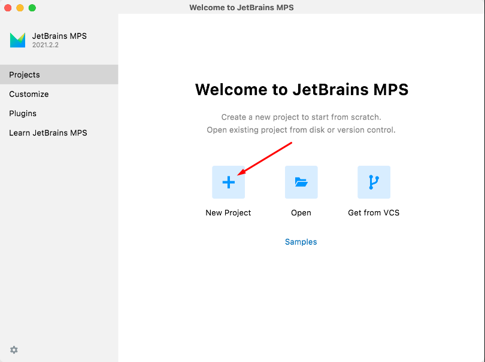

**Figure 1 - MPS new project creation wizard**

During the project creation process, it is possible to select the option to **create a Sandbox Solution**. Enabling this option automatically generates a testing environment where instances of the domain-specific language can be created and evaluated (Figure 2).

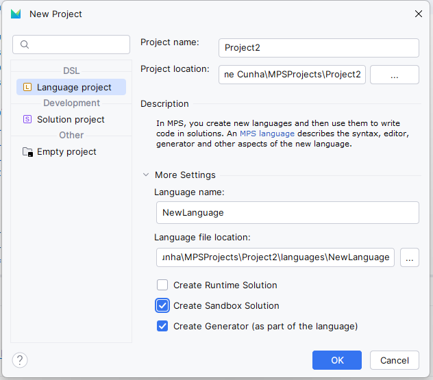

**Figure 2 - MPS option to create a language and sandbox solution**

A sandbox solution is particularly useful during language development, as it allows developers to experiment with language concepts and validate their behavior without affecting the core language implementation.

### 5. Implementing the DSL

After the project has been successfully created, the developer can begin implementing the domain-specific language. This process involves defining **language concepts**, specifying **constraints** and configuring **generation rules** that determine how models created using the DSL are transformed into executable code.

The sandbox environment can then be used to create example models and test the behavior of the developed language.
## Implementation of the Metamodel

The metamodel was implemented in the **Structure** aspect of the language, primarily in:

- `part1/tool1-mps/languages/Ref/models/Ref.structure.mps`

The root concept is `RefModel`, which aggregates the complete DSL definition for one platform/domain instance.

### Core structural organization

| Area | Main concepts | Modeling role |
|---|---|---|
| Core | `RefModel` | Root container of all types, rules and policies |
| Actors & Context | `UserType`, `UserTypeSuperType`, `ContextType`, `ContextResourceTypeLink` | Represents roles, role hierarchy and context scoping |
| Structure | `ResourceType`, `Attribute`, `ResourceRelation` | Defines resources, their fields and inter-resource links |
| Feedback | `FeedbackType`, `FeedbackDefinition`, `FeedbackPolicy`, `RatingPolicy` | Defines feedback semantics and target/author bindings |
| Governance & Behavior | `ValidationRule`, `AuthorizationRule`, `ModerationPolicy`, `AutomationRule`, `Condition`, `Action`, `VerificationPolicy`, `SortingPolicy` | Encodes validation, permissions, moderation, automation and ordering behavior |

### Concepts, properties, children and references

`RefModel` includes containment children for all major DSL elements (`userType`, `resourceType`, `contextType`, `resourceRelation`, `feedbackType`, `feedbackDefinition`, `authorizationRule`, `validationRule`, `moderationPolicy`, `automationRule`, `verificationPolicy` and `sortingPolicy`).

Representative concept design decisions:

- `UserType` stores role classification through `kind` and supports inheritance via child nodes (`UserTypeSuperType`) that reference another `UserType`.
- `ResourceType` stores `supportsMedia`, contains multiple `Attribute` children and supports inheritance through super-type links.
- `Attribute` captures field-level metadata (`type`, `required`, `multiValued`) to keep resource schemas explicit.
- `ResourceRelation` models typed links between resources through `sourceResourceType` and `targetResourceType`, with control properties (`sourceCardinality`, `targetCardinality`, `containment`, `recursive`).
- `FeedbackType` defines generic feedback semantics (e.g., `kind`, `subjectScope`, `hasRating`, `recursive`, `allowsText`, `allowsMedia`, `polarity`).
- `FeedbackDefinition` binds one feedback type to domain targets and author role via references (`feedbackType`, `subjectResource` or `subjectFeedback`, `author`) and optional children (`feedbackPolicy`, `ratingPolicy`).
- `AutomationRule` combines event trigger properties with references (`feedbackDefinition`, `context`, `inContext`, `uses`) and child lists (`conditions`, `actions`).

This structure allows one unified metamodel to instantiate multiple scenarios (Amazon, Reddit and YouTube) without changing the language definition, only changing model instances.

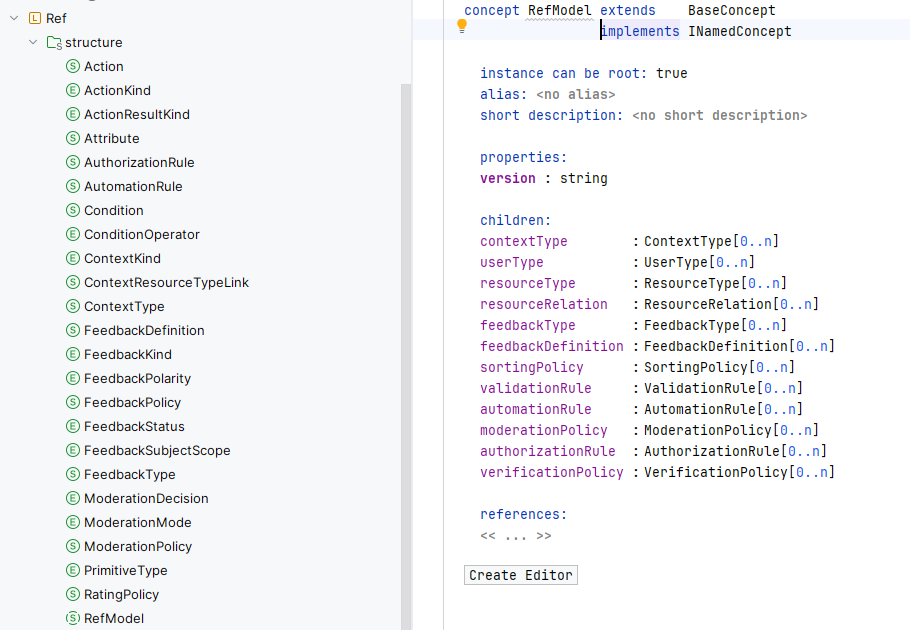

**Figure 3 - Structure aspect with the RefModel concept tree**

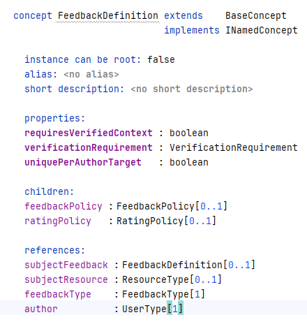

**Figure 4 - FeedbackDefinition concept with main properties and references**

## Implementation of Constraints

The constraints were implemented as **Non-Typesystem Checking Rules** in MPS and generated to Java classes. The authoritative generated artifacts are located in:

- `part1/tool1-mps/languages/Ref/source_gen/Ref/typesystem/TypesystemDescriptor.java`
- `part1/tool1-mps/languages/Ref/source_gen/Ref/typesystem/*_NonTypesystemRule.java`
- `part1/tool1-mps/languages/Ref/source_gen/Ref/typesystem/*_QuickFix.java`

For this individual report, representative examples are presented instead of an exhaustive catalog. The selected examples prioritize constraints that already provide Quick Fix support.

### Property-oriented constraints (data/property validation)

| Checking Rule | Concept | What is tested | Example failing state | Quick Fix |
|---|---|---|---|---|
| checkNameUppercase | INamedConcept | Name must start with uppercase | `user` instead of `User` | `fixCapitalizeName_QuickFix` (`apply immediately = true`) |
| checkValidationRuleLength | ValidationRule | `implementationId` must have at least 3 chars | `ab` | `fixValidationRuleImplementationIdLength_QuickFix` |
| checkRatingPolicyMinMaxValue | RatingPolicy | `minValue < maxValue` | `min=5`, `max=1` | `swapRatingPolicyMinMaxIfMinBiggerMax_QuickFix` |
| checkRatingPolicyPositiveEven | RatingPolicy | `step > 0` and range divisibility | `step=0` or uneven step | `fixRatingPolicyStepInvalidOrUneven_QuickFix` |
| checkNoSelfInResourceTypeSuperTypes | ResourceType | No direct self-inheritance | `ResourceType A` extends `A` | `removeResourceTypeSuperTypeWhenContainSelf_QuickFix` |

### Business-rule constraints (domain semantics)

| Checking Rule | Concept | Business rule enforced | Example failing state | Quick Fix |
|---|---|---|---|---|
| checkFeedbackTypeKindSubscriptionResourceOnlyNonRecursive | FeedbackType | SUBSCRIPTION must be RESOURCE_ONLY and non-recursive | `kind=SUBSCRIPTION` with `recursive=true` | `fixFeedbackTypeKindSubscription_QuickFix` |
| checkFeedbackTypeReactionVoteDisallowRatingAndRecursion | FeedbackType | REACTION/VOTE cannot have rating or recursion | `kind=REACTION` and `hasRating=true` | `disableFeedbackTypeRatingAndRecursionForReactionVote_QuickFix` |
| checkFeedbackDefinitionReactionVoteDisallowRating | FeedbackDefinition | REACTION/VOTE feedback definitions cannot keep `RatingPolicy` | Add `RatingPolicy` to reaction/vote feedback | `removeRatingPolicy_QuickFix` |
| checkFeedbackDefinitionVerificationPolicy | FeedbackDefinition | Verified feedback requires matching `VerificationPolicy` | `requiresVerifiedContext=true` without policy | `createVerificationPolicyForFeedbackDefinition_QuickFix` |
| checkModerationPolicyMandatoryExecutedBy | ModerationPolicy | Moderation policy must define moderator actor | `executedBy = null` | `fixAssignModeratorToModerationPolicyWhenExecutedByEmpty_QuickFix` |

Quick Fixes are connected to rules through `reportTypeError(...).addIntentionProvider(...)` using MPS "Intention to fix an error" providers (`BaseQuickFixProvider`).

| Checking Rule | Quick Fix class | Apply immediately |
|---|---|---|
| checkNameUppercase | Ref.typesystem.fixCapitalizeName_QuickFix | true |
| checkValidationRuleLength | Ref.typesystem.fixValidationRuleImplementationIdLength_QuickFix | false |
| checkRatingPolicyMinMaxValue | Ref.typesystem.swapRatingPolicyMinMaxIfMinBiggerMax_QuickFix | false |
| checkRatingPolicyPositiveEven | Ref.typesystem.fixRatingPolicyStepInvalidOrUneven_QuickFix | false |
| checkNoSelfInResourceTypeSuperTypes | Ref.typesystem.removeResourceTypeSuperTypeWhenContainSelf_QuickFix | false |
| checkFeedbackTypeKindSubscriptionResourceOnlyNonRecursive | Ref.typesystem.fixFeedbackTypeKindSubscription_QuickFix | false |
| checkFeedbackTypeReactionVoteDisallowRatingAndRecursion | Ref.typesystem.disableFeedbackTypeRatingAndRecursionForReactionVote_QuickFix | false |
| checkFeedbackDefinitionReactionVoteDisallowRating | Ref.typesystem.removeRatingPolicy_QuickFix | false |
| checkFeedbackDefinitionVerificationPolicy | Ref.typesystem.createVerificationPolicyForFeedbackDefinition_QuickFix | false |
| checkModerationPolicyMandatoryExecutedBy | Ref.typesystem.fixAssignModeratorToModerationPolicyWhenExecutedByEmpty_QuickFix | false |

Special note: `checkNameUppercase` is the only selected example configured with `apply immediately = true`.

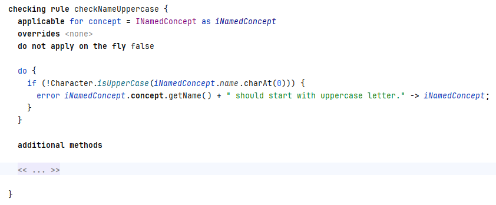

**Figure 5 - Non-typesystem rule checkNameUppercase**

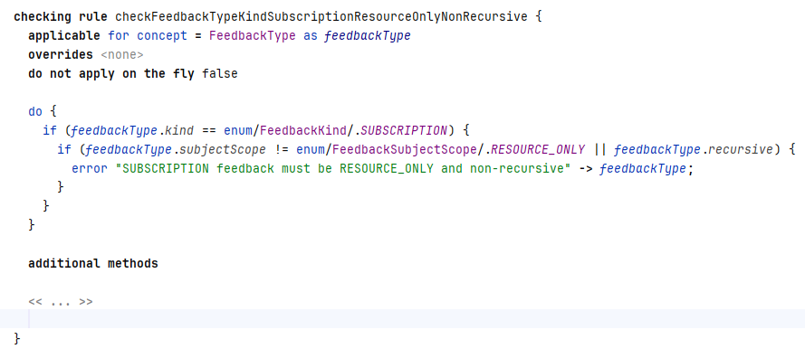

**Figure 6 - Non-typesystem rule checkFeedbackTypeKindSubscriptionResourceOnlyNonRecursive**

## Implementation of the Visualizations

Visualizations were implemented in the **Behavior** aspect of the language, mainly through two methods defined on `RefModel`:

- `toPlantUml()` for structural/behavioral diagram generation.
- `toText()` for textual projection generation.


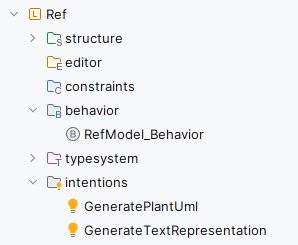

**Figure 7 - Project tree showing behavior and intentions folders**

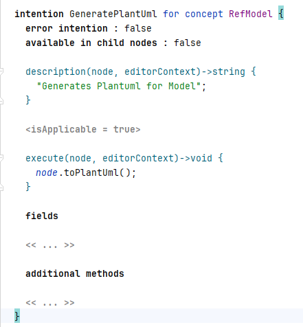

**Figure 8 - GeneratePlantUml intention implementation example**

The generated Java artifacts confirming this implementation are:

- `part1/tool1-mps/languages/Ref/source_gen/Ref/behavior/RefModel__BehaviorDescriptor.java`
- `part1/tool1-mps/languages/Ref/source_gen/Ref/intentions/GeneratePlantUml_Intention.java`
- `part1/tool1-mps/languages/Ref/source_gen/Ref/intentions/GenerateTextRepresentation_Intention.java`

### Behavior design and generation flow

`toPlantUml()` builds the `.puml` output by traversing the root `RefModel` and emitting content in logical packages:

1. Core
2. Actors & Context
3. Structure
4. Feedback
5. Governance & Behavior

It then emits relations (composition, references, inheritance) via helper methods equivalent to `printClass(...)` and `relation(...)`, ensuring that both entities and links are represented.

`toText()` traverses the same model and emits a human-readable structured projection with sections such as:

- `=== CORE ===`
- `=== ACTORS & CONTEXT ===`
- `=== STRUCTURE ===`
- `=== FEEDBACK ===`
- `=== GOVERNANCE & BEHAVIOR ===`

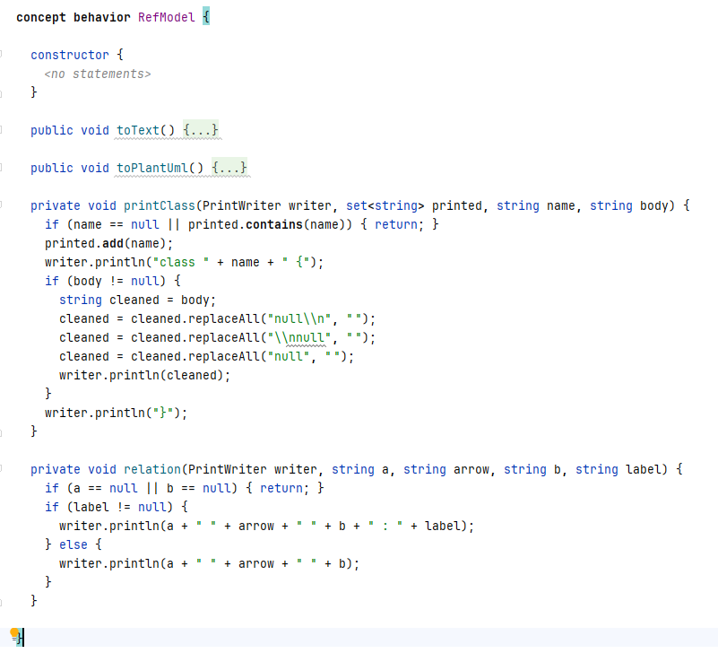

**Figure 9 - RefModel behavior concept with generation methods**

### Triggering and output locations

Generation is triggered from the MPS intention menu:

- `GeneratePlantUml`
- `GenerateTextRepresentation`

At runtime, both methods write files to `System.getProperty("user.home")` using the model name:

- `mps-<RefModelName>.puml`
- `mps-<RefModelName>.txt`

For this project deliverable, generated artifacts are available under:

- `part1/tool1-mps/representations/visual/`
- `part1/tool1-mps/representations/textual/`

This confirms that the visualization implementation is integrated with model instances and can be regenerated on demand.

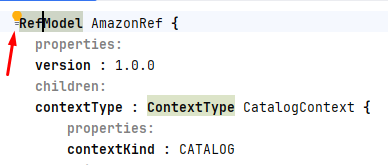

**Figure 10 - Intention hint icon in the MPS editor**

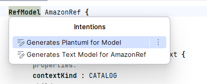

**Figure 11 - Intention menu with GeneratePlantUml and GenerateTextRepresentation**

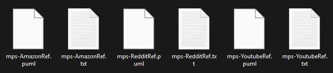

**Figure 12 - File Explorer with generated PlantUML and text files**

## Implementation of Models (instances)

The model instances are defined in one sandbox model file:

- `part1/languages/Ref.sandbox/models/Ref.sandbox.mps`

This sandbox contains **three root `RefModel` instances**, covering all three target scenarios:

- `AmazonRef`
- `RedditRef`
- `YoutubeRef`

Main instantiated concepts per root model:

| Root RefModel | Scenario | Main concepts instantiated |
|---|---|---|
| `AmazonRef` | Amazon-like review domain | `UserType`, `ContextType`, `ResourceType` + `Attribute`, `ResourceRelation`, `FeedbackType`, `FeedbackDefinition` + `FeedbackPolicy` + `RatingPolicy`, `AuthorizationRule`, `ValidationRule`, `AutomationRule` + `Condition` + `Action`, `ModerationPolicy`, `VerificationPolicy`, `SortingPolicy` |
| `RedditRef` | Reddit-like community domain | `UserType`, `ContextType`, `ResourceType` + `Attribute`, `ResourceRelation`, `FeedbackType`, `FeedbackDefinition` + `FeedbackPolicy`, `AuthorizationRule`, `ValidationRule`, `AutomationRule` + `Condition` + `Action`, `ModerationPolicy`, `SortingPolicy` |
| `YoutubeRef` | YouTube-like media domain | `UserType`, `ContextType`, `ResourceType` + `Attribute`, `ResourceRelation` (including recursive comment relation), `FeedbackType`, `FeedbackDefinition` + `FeedbackPolicy`, `AuthorizationRule`, `ValidationRule`, `AutomationRule` + `Condition` + `Action`, `ModerationPolicy`, `SortingPolicy` |

Interesting and complex instance highlighted: `YoutubeRef` exercises multiple metamodel dimensions at once, including user role hierarchy (`Creator`/`Moderator` extending `User`), multiple contexts (`ChannelContext`, `TrendingContext`, `RecommendationContext`), moderation automation (`AutoVideoModeration`, `AutoCommentModeration`) and interaction feedback definitions (`Like`, `Report`, `Subscription`).

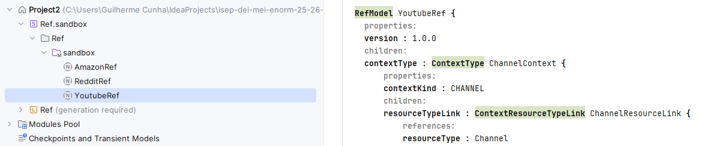

**Figure 13 - YoutubeRef model instance in Ref.sandbox.mps**

## Execution of Constraints

From static repository artifacts alone, there are no persisted "active error markers" stored in `.mps` files. Constraint execution is performed at edit/typecheck time in the MPS UI.

Using the current instances, the following representative violations are directly reproducible (property-oriented + business-rule oriented), with emphasis on rules that have Quick Fixes:

| Case | Type | Where to reproduce | Violated rule | What is wrong | Quick Fix behavior |
|---|---|---|---|---|---|
| 1 | Property | `YoutubeRef` -> `UserType: User` (in `Ref.sandbox.mps`) | `checkNameUppercase` | Rename `User` to `user` to violate uppercase naming on `INamedConcept`. | `fixCapitalizeName_QuickFix` restores uppercase (`apply immediately = true`). |
| 2 | Property | `AmazonRef` -> `FeedbackDefinition: ProductReview` -> `RatingPolicy: ProductReviewRating` | `checkRatingPolicyMinMaxValue` | Set `minValue >= maxValue` (e.g., `minValue=5`, `maxValue=1`). | `swapRatingPolicyMinMaxIfMinBiggerMax_QuickFix` swaps values to a valid range. |
| 3 | Business rule | `YoutubeRef` -> `FeedbackType: SubscriptionType` | `checkFeedbackTypeKindSubscriptionResourceOnlyNonRecursive` | Set `recursive=true` or a non-`RESOURCE_ONLY` subject scope for a SUBSCRIPTION type. | `fixFeedbackTypeKindSubscription_QuickFix` resets to valid semantics. |
| 4 | Business rule | `AmazonRef` -> `FeedbackDefinition: ProductReview` | `checkFeedbackDefinitionVerificationPolicy` | Set `requiresVerifiedContext=true` and remove associated verification policy. | `createVerificationPolicyForFeedbackDefinition_QuickFix` creates the missing policy node and link. |

How MPS surfaces violations during execution:

- The invalid node is marked with a red error indicator in the editor.
- Hovering the marker shows the exact `reportTypeError(...)` message.
- `Alt+Enter` opens the intention menu with mapped Quick Fix actions.

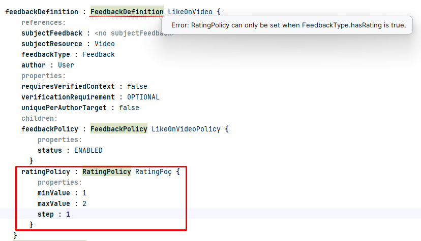

**Figure 14 - Active constraint violation with red marker and error tooltip**

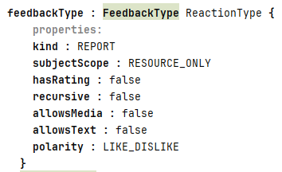

**Figure 15 - FeedbackType reaction configuration with hasRating set to false**


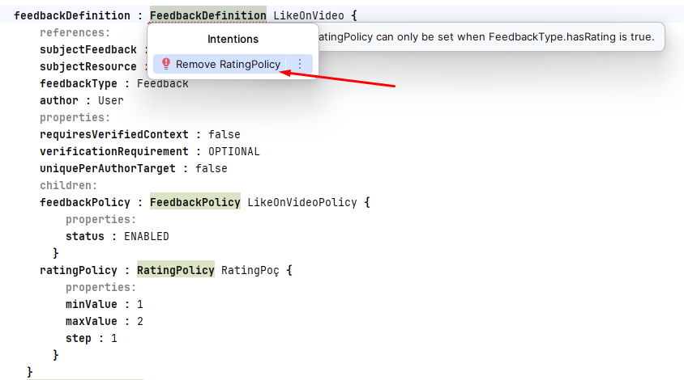

**Figure 16 - Quick fix intention menu for the detected constraint error**

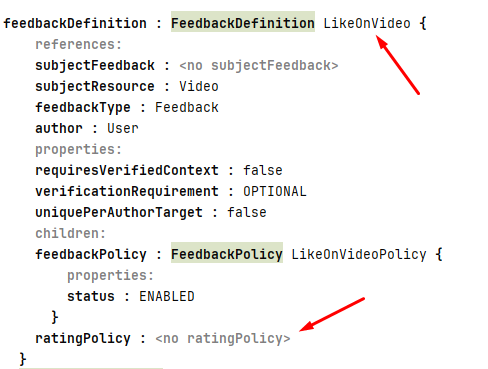

**Figure 17 - Model after applying quick fix with no error and no RatingPolicy**

## Generation/Execution of Visualizations

Visualization generation is implemented via intentions:

- `GeneratePlantUml` -> invokes `toPlantUml()`
- `GenerateTextRepresentation` -> invokes `toText()`

Both methods are defined in generated behavior code (`RefModel__BehaviorDescriptor`) and write files to `System.getProperty("user.home")` as:

- `mps-<RefModelName>.puml`
- `mps-<RefModelName>.txt`

In this repository, generated outputs are already available under:

- `part1/tool1-mps/representations/visual/`
- `part1/tool1-mps/representations/textual/`

The following figure shows the intention menu on `Ref.sandbox.mps`, where `GeneratePlantUml` and `GenerateTextRepresentation` are available.

The following excerpt was taken from `part1/tool1-mps/representations/visual/mps-YoutubeRef.puml`.

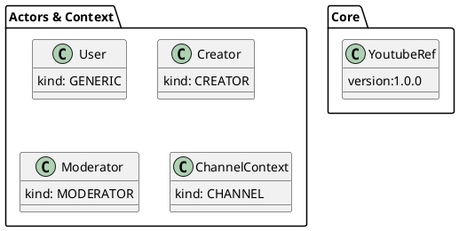

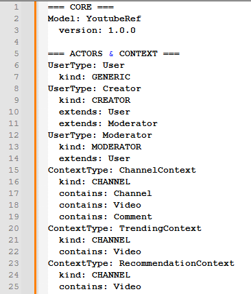

**Figure 18 - Textual projection excerpt from mps-YoutubeRef.txt**

```text
=== CORE ===
Model: YoutubeRef
	version: 1.0.0

=== ACTORS & CONTEXT ===
UserType: User
	kind: GENERIC
UserType: Creator
	kind: CREATOR
	extends: User
	extends: Moderator
UserType: Moderator
	kind: MODERATOR
	extends: User
ContextType: ChannelContext
	kind: CHANNEL
	contains: Channel
```

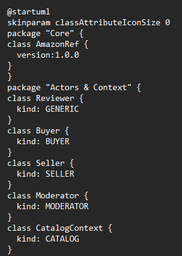

**Figure 19 - Rendered PlantUML diagram generated from mps-YoutubeRef.puml output**

Note: rendering the diagram itself requires PlantUML rendering in an IDE/plugin or CLI renderer. The repository currently provides the `.puml` sources and textual projections.
