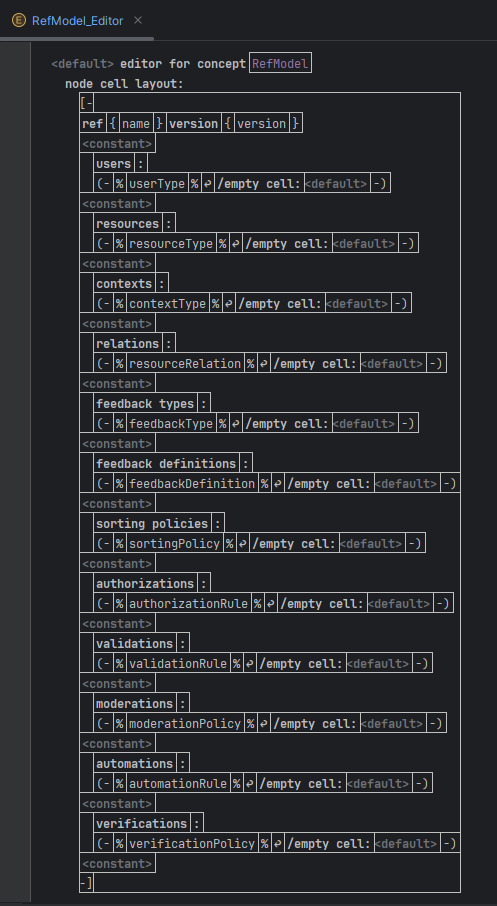
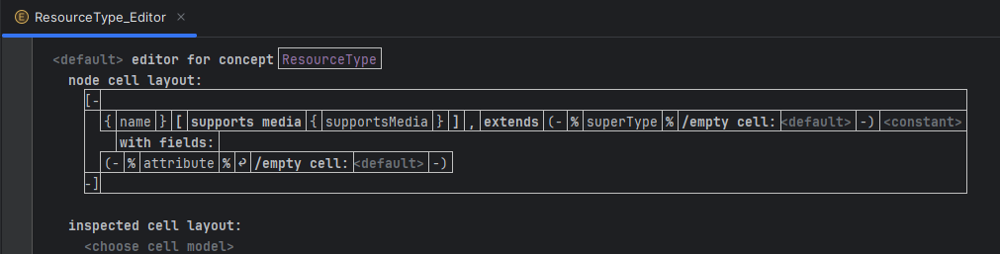
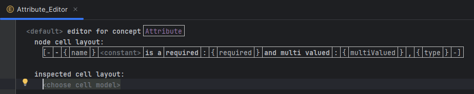
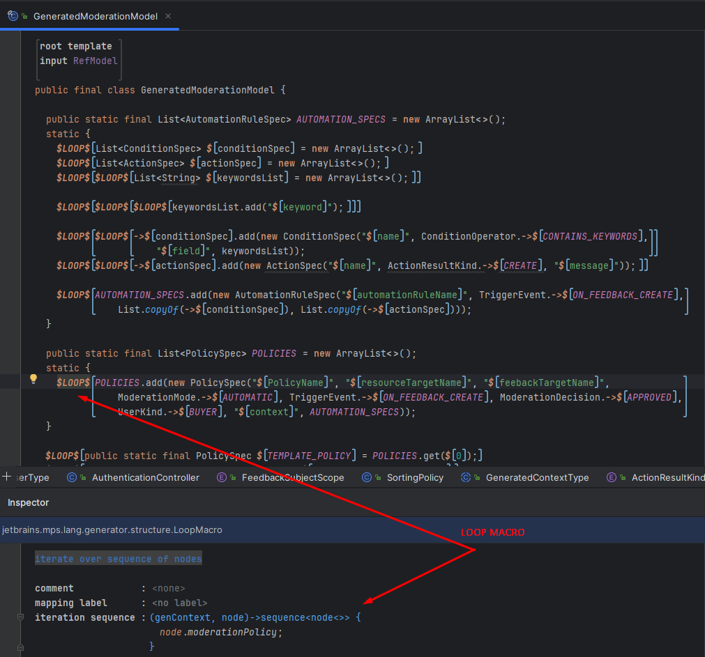

# ENORM Project, Part 2, Tool 1 - MPS (Meta Programming System)

## 1. Context and Link to Part 1

In Part 1 of the ENORM project, the MPS work focused on implementing the REF metamodel: concepts in the `Structure` aspect, validation rules, quick fixes, behavior methods for generating projections, and example models for Amazon, Reddit, and YouTube. That phase was mainly about domain modeling, namely defining the concepts required to represent resources, users, feedback, authorizations, validations, moderation policies, automations, and other domain concerns.

In Part 2, the goal was to turn that metamodel into a more usable DSL capable of generating applications. The assignment explicitly required the design of the concrete syntax, the identification of common and variable backend parts, the implementation of code generation, the generation of the three reference applications, and support for manual extensions in the generated code.

Therefore, the MPS work in this phase continued the DSL developed in Part 1 and added two main capabilities:

- a textual syntax closer to the notation defined in the team report;
- a generator capable of transforming a `RefModel` into a Spring Boot backend with Java code and configuration files.

This approach addresses the central problem of the project: creating a REF DSL that can be used to specify Resource Evaluation and Feedback applications and generate most of the code required for the corresponding REST microservices.

## 2. Textual Syntax Implementation in MPS

The textual syntax was implemented in MPS through `Editors`. Since MPS uses projectional editing, the DSL does not depend on a traditional textual parser. The user edits the AST directly, while the editors define how each concept is visually presented. This makes it possible to create a representation that is close to a textual DSL while preserving the structural validation provided by MPS.

The main editor was defined for the global `RefModel` concept. This editor acts as the entry point of the model and contains the editors of the child concepts. As a result, the complete model is presented as a composition of sections and elements instead of a technical tree that would be harder to read.

This design is aligned with the textual syntax described in the team report, where the model is organized by areas such as users, resources, feedback definitions, policies, automations, and verifications. In MPS, this organization is achieved through editor composition, where the global editor delegates the presentation of each element to the editor of the corresponding concept.

A relevant example is the editor for the `ResourceType` concept. This editor shows the resource name, whether it supports media, its optional super type, and its list of attributes. `ResourceType` contains other editors, such as `ResourceTypeSuperType` and `Attribute`, allowing the resource structure to be edited in a compact and readable way.

The `Attribute` editor presents the essential information for each field: name, whether it is required, whether it is multi-valued, and its primitive type. This information is important because it is later used by the generator to produce Java fields, simple validations, and parts of the domain artifacts.

In practice, the `ResourceType` syntax was designed to read almost like text, for example:

```text
{name} [ supports media {supportsMedia} ] , extends <superType> with fields:
  <attribute>*
```

Each `Attribute` is presented directly:

```text
{name} is a required : {required} and multi valued : {multiValued} , {type}
```

These editors are small, but composing them inside the global `RefModel` editor makes it possible to edit complete models without exposing the internal structure as a technical tree.

In summary, the textual syntax implementation in MPS used:

- a global editor for `RefModel`, responsible for containing the remaining elements;
- specific editors for child concepts such as `ResourceType`, `Attribute`, `FeedbackDefinition`, `ModerationPolicy`, `AutomationRule`, `Condition`, and `Action`;
- editor composition to represent containment, such as attributes inside resources and conditions/actions inside automation rules;
- editable references to connect concepts such as resource types, feedback definitions, user types, and contexts.

This solution makes the DSL closer to the domain language while keeping it strongly typed, because each edited value still corresponds to a property, child, or reference in the MPS metamodel.

### RefModel Editor (root)



### ResourceType & Attribute Editor





### Result Example


## 3. Code Generation Approach

Code generation was implemented with the MPS Generator. The main input of the generation process is a `RefModel`, which contains the structural and behavioral elements of the scenario to generate. From this model, the generator produces backend projects compatible with the architecture defined by the team: Java, Spring Boot, Spring Data JPA, Maven, H2, and a separation between generated code and manual code.

The generator follows a model-to-code logic:

- `RefModel` generates global application artifacts, such as the Spring Boot application class, configuration, enums, security, global services, and project files;
- `ResourceType` generates entities, repositories, services, and controllers for domain resources;
- `FeedbackDefinition` generates entities, repositories, services, and controllers for feedback elements such as reviews, comments, votes, reports, likes, or subscriptions;
- policies and rules from `RefModel` generate support classes for authorization, validation, moderation, automation, verification, and sorting;
- `ModerationPolicy`, `AutomationRule`, `Condition`, and `Action` feed `GeneratedModerationModel` and the base moderation behavior.

Java generation was implemented with MPS Generator templates. For files that are naturally textual, `PlainTextGenerator` was used, namely:

- `pom.xml`, containing Maven dependencies and project configuration;
- `application.properties`, containing Spring Boot, H2, and runtime configuration.

This decision was important because `pom.xml` and `application.properties` are not Java code and do not benefit from Java AST-based templates. Generating them as text made the process more direct and easier to control.

## 4. Generated Artifact Structure

The prototypes generated by MPS follow the same general organization defined by the team for Part 2. The goal was to produce Spring Boot applications with a consistent architecture across Amazon, Reddit, and YouTube.

The main generated artifact groups are:

- `domain/generated`: generated base classes, usually with the `Generated*` prefix;
- `domain`: manual classes that extend the generated classes;
- `domain/enums`: enums used by the domain, such as `UserKind`, `TriggerEvent`, `ConditionOperator`, `ActionResultKind`, `ModerationMode`, and `ModerationDecision`;
- `repository/generated` and `repository`: generated repositories and manual extensions;
- `service/generated` and `service`: generated services and manual services;
- `web/generated` and `web`: generated controllers and manual controllers;
- `security`: security/JWT configuration;
- `config`: Spring/H2 configuration and initial data;
- `src/main/resources/application.properties`;
- `pom.xml`.

This organization applies the Generation Gap strategy. The generator can recreate the `Generated*` classes, while manual code remains separate. This addresses the Part 2 requirement for supporting manual Java adaptations when the DSL cannot express all business logic.

Examples of artifacts produced in the MPS prototypes include:

- `GeneratedProduct`, `GeneratedPost`, `GeneratedVideo`, `GeneratedComment`, and other resources;
- `GeneratedProductReview`, `GeneratedVoteOnPost`, `GeneratedReportOnComment`, `GeneratedLikeOnVideo`, and other forms of feedback;
- `Generated*Repository` for persistence;
- `Generated*Service` for base operations;
- `Generated*Controller` for REST endpoints;
- `GeneratedPolicyService`, `GeneratedModerationModel`, and `GeneratedModerationService` for policies and moderation.

## 5. Relevant Generator Macros

To make generation efficient, several MPS Generator macros were used. These macros made it possible to transform a small set of generic templates into many concrete files, depending on the elements present in the `RefModel`.

The most important macros were `LOOP`, `IF`, `Reference`, and `Property`.

### `LOOP`

`LOOP` macros were used to iterate over model elements. The most common input is the `RefModel`, and the loops mainly iterate over:

- `resourceType`, to generate resource entities, repositories, services, and controllers;
- `feedbackDefinition`, to generate feedback entities, repositories, services, and controllers;
- `moderationPolicy`, to generate entries in `GeneratedModerationModel.POLICIES`;
- `automationRule`, to generate `AutomationRuleSpec`;
- `conditions` inside each automation rule, to generate `ConditionSpec`;
- values/keywords inside each condition, to generate string lists;
- `actions` inside each automation rule, to generate `ActionSpec`;
- global policies, such as authorization, validation, sorting, and verification.

A particularly important case is the `GeneratedModerationModel` template. In this template, loops materialize the behavioral part of the DSL into Java constants. For example, an automation rule from the model results in a list of conditions, a list of actions, and finally an `AutomationRuleSpec`.

### `IF`

`IF` macros were used when generation depends on the existence of specific elements or optional values. Examples include:

- generating moderation files only when `RefModel.moderationPolicy` is not empty;
- generating rating fields only when a `RatingPolicy` exists;
- generating media support when a resource or feedback element supports media;
- generating references to a resource target or feedback target only when those references exist;
- generating different parts depending on whether a target is a `ResourceType` or a `FeedbackDefinition`.

This avoids generating invalid or unnecessary code when a feature is not present in the model.

### `Reference`

`Reference` macros were used to resolve links between model elements and generated code elements. In the template excerpt, these macros are represented by `->`. The idea is that the template does not only write fixed text: it resolves the correct reference in the current generation context.

Typical examples include:

- `ConditionOperator.->$CONTAINS_KEYWORDS`, where the generated enum receives the literal corresponding to the condition operator;
- `TriggerEvent.->$ON_FEEDBACK_CREATE`, where the automation or policy trigger is converted into the correct Java enum;
- `List.copyOf(->$conditionSpec)`, where the reference points to the list generated in the current loop;
- references to generated classes, such as repositories, services, controllers, and nested specs.

These macros are important because they preserve the link between the MPS model and the generated Java code. Instead of manually writing class names, enum literals, or variable names, the generator resolves them from the current node and the references in the model.

### `Property`

`Property` macros were used to replace simple template values with model properties. Examples include:

- `$name`, for resource, feedback, condition, or action names;
- `$keyword`, for condition keyword values;
- `$PolicyName`, for policy names;
- `$resourceTargetName` and `$feedbackTargetName`, for moderation targets;
- `$message`, for messages associated with actions;
- package names, class names, routes, database names, and artifact ids derived from `RefModel`.

These macros are the main mechanism for making each scenario generate code with the correct names. For example, the same template can generate `GeneratedProductService`, `GeneratedPostService`, or `GeneratedVideoService`, depending on the `ResourceType` processed by the loop.

### GeneratedModerationModel template



## 6. Example: Moderation Model Generation

The following excerpt represents the logic used in the `GeneratedModerationModel` template. Its purpose is to transform policies, automation rules, conditions, and actions from the `RefModel` into Java structures used at runtime by the moderation service.

```java
public static final List<AutomationRuleSpec> AUTOMATION_SPECS = new ArrayList<>();
static {
  $LOOP$ List<ConditionSpec> $conditionSpec = new ArrayList<>();
  $LOOP$ List<ActionSpec> $actionSpec = new ArrayList<>();
  $LOOP$$LOOP$ List<String> $keywordsList = new ArrayList<>();

  $LOOP$$LOOP$$LOOP$ keywordsList.add("$keyword");

  $LOOP$$LOOP$ ->conditionSpec.add(
      new ConditionSpec("$name", ConditionOperator.->$CONTAINS_KEYWORDS, "$field", keywordsList));

  $LOOP$$LOOP$ ->actionSpec.add(
      new ActionSpec("$name", ActionResultKind.->$CREATE, "$message"));

  $LOOP$ AUTOMATION_SPECS.add(
      new AutomationRuleSpec("$automationRuleName", TriggerEvent.->$ON_FEEDBACK_CREATE,
      List.copyOf(->conditionSpec), List.copyOf(->actionSpec)));
}
```

In this example:

- the first `LOOP` level creates structures per automation rule;
- the inner loops create condition and action lists;
- another loop iterates over the values/keywords of each condition;
- `Property` macros fill names, messages, fields, and keywords;
- `Reference` macros represented by `->` resolve enum literals and generated variables in the correct context.

The real Java output contains structures such as:

- `AUTOMATION_SPECS`, with all generated automation rules;
- `POLICIES`, with moderation policies;
- `PolicySpec`, containing name, targets, mode, trigger, decision, executor, and automation rules;
- `AutomationRuleSpec`, containing trigger, conditions, and actions;
- `ConditionSpec`, containing operator, attribute, and values;
- `ActionSpec`, containing action result kind and message.

With this approach, the backend does not need to load the DSL at runtime. The behavioral information required for moderation is materialized directly in the generated code.

## 7. Relation to the Part 2 Problems

The MPS solution addresses the main points of the Part 2 assignment.

Regarding concrete syntax, MPS Editors provide a textual/projectional notation for the REF model, aligned with the textual syntax described in the team report. This makes the DSL more readable for users who understand the domain, while preserving the structural control provided by MPS.

Regarding code generation, the MPS Generator transforms REF models into Spring Boot applications. This is aligned with the goal of generating most of the backend required for Resource Evaluation and Feedback REST microservices.

Regarding commonality and variability, the templates capture the common part of the architecture: Spring Boot, JPA, repositories, services, controllers, security, configuration, and error handling. The variable parts come directly from the model: resources, attributes, feedback definitions, policies, automation rules, conditions, actions, and enum values.

Regarding support for structure, authorization, and behavior, the generation covers:

- structure, through `ResourceType`, `Attribute`, `ResourceRelation`, and JPA entities;
- authorization, through `AuthorizationRule`, user kinds, and security components;
- behavior, through `ValidationRule`, `ModerationPolicy`, `AutomationRule`, `Condition`, `Action`, `VerificationPolicy`, and `SortingPolicy`.

Regarding extensibility, the Generation Gap strategy allows software engineers to manually complete logic that the DSL does not fully describe. This is important for validations with `implementationId`, scenario-specific business rules, ownership checks, rating summaries, or external integrations.

Regarding evolution, the separation between model, editors, templates, and manual code makes it possible to adapt the DSL and regenerate code while preserving manual extensions whenever the generated contracts remain compatible.

## 8. Generated Scenarios

The MPS implementation was used to generate prototypes for the three scenarios required by the project:

- Amazon, with products, orders, reviews, helpful votes, verification, and moderation;
- Reddit, with subreddits, posts, comments, votes, reports, and automations;
- YouTube, with channels, videos, comments, likes, reports, subscriptions, and moderation.

The generated and compiled applications are available in the MPS prototypes folder. Each prototype contains the generated Spring Boot backend for one REF scenario:

- Amazon prototype: `part2/tool1-mps/prototypes/amazon-prototype`
- Reddit prototype: `part2/tool1-mps/prototypes/reddit-prototype`
- YouTube prototype: `part2/tool1-mps/prototypes/youtube-prototype`

These scenarios are important because they exercise different parts of the metamodel. Amazon mainly validates reviews, rating, and verification. Reddit validates automations and community moderation. YouTube validates media resources, feedback on videos/comments, and moderation policies.

The fact that all of them are generated from the same language confirms that the DSL is not limited to a single specific case. What changes is the content of the `RefModel`; the generation structure remains consistent.

## 9. Conclusion

The MPS DSL implementation in Part 2 completed the work started in Part 1. The metamodel stopped being only a structural representation of the domain and started supporting a textual/projectional syntax and code generation for executable prototypes.

The Editors made the DSL more readable and aligned with the textual syntax defined by the team. The MPS Generator, complemented by `PlainTextGenerator`, made it possible to generate Java code, `pom.xml`, and `application.properties`. The `LOOP`, `IF`, `Reference`, and `Property` macros were essential to make the templates reusable, because they allow the generator to iterate over the `RefModel` and generate different code for resources, feedback definitions, policies, automation rules, conditions, and actions.

Overall, this implementation addresses the Part 2 objectives by transforming REF models into consistent, extensible Spring Boot backends aligned with the Amazon, Reddit, and YouTube scenarios.
